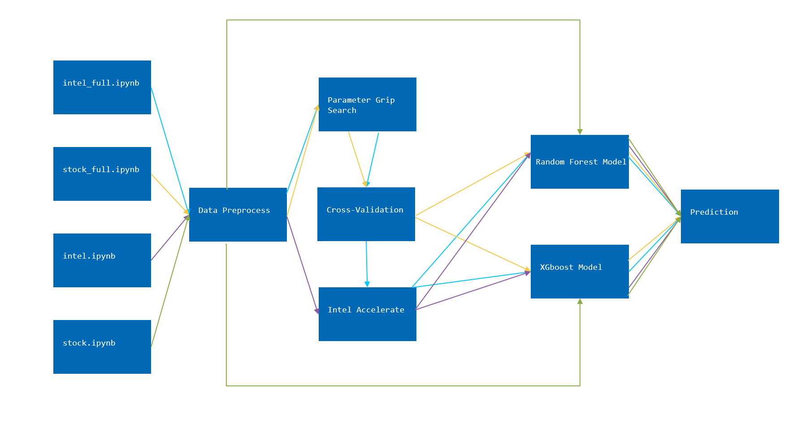

## The detection of credit card transaction fraud – Applying machine learning methods with Intel® oneAPI AI Analytics Toolkit

1. Introduction

* Amidst the Surge in digital transactions, credit cards have emerged as a revolutionary payment tool. However, the pervasive fraud against credit cards poses a formidable thread to the stability of financial systems. This constitutes a worrisome issue for banks, customers, and financial institutions in terms of significant financial losses, trust crisis, and reputation decrease. Considering the sharp rise in fraudulent credit card transactions, detecting fraudulent activities during transactions is crucial in aiding consumers and banks. This projecct uses the 
random forest with several data-preprocessing methods as the main machine learning method, embedding the Intel® oneAPI AI Analytics Toolkit to train a series of machine learning models, anticipating fraud activities lurking in credit card trades. The results demonstrate that applying the Intel® oneAPI AI Analytics Toolkit, the machine learning process demonstrates a satisfied outcome with celerity and binary classification accuracy.

2. Setting up the Environment:

* This project leverages Intel's Intel® oneAPI AI Analytics Toolkit for accelerating machine learning. For downloading the relevant libraries, please refer to the README file at https://github.com/huiyan2021/oneAPI-samples.
  
3. Project Structure and description:

* The project comprises four executable notebook files: intel.ipynb, stock.ipynb, intel_full.ipynb, stock_full.ipynb.
* All four files use random forest and XGBoost models to train on fraudulent data from the creditcard.csv file in this folder (For more information on the data, refer to the source: https://github.com/oneapi-src/credit-card-fraud-detection).
* Each file uses training time, accuracy, F1 score, and inference time as performance metrics.
* Preprocessing of data is performed before training the models in all four files.
* Files labeled with "stock" use the official random forest and XGBoost libraries, while those labeled with "intel" utilize Intel-accelerated machine learning libraries.
* Files labeled with "full" further employ parameter grid search and cross-validation for optimization.
* Running the files generates corresponding model data files and log information.